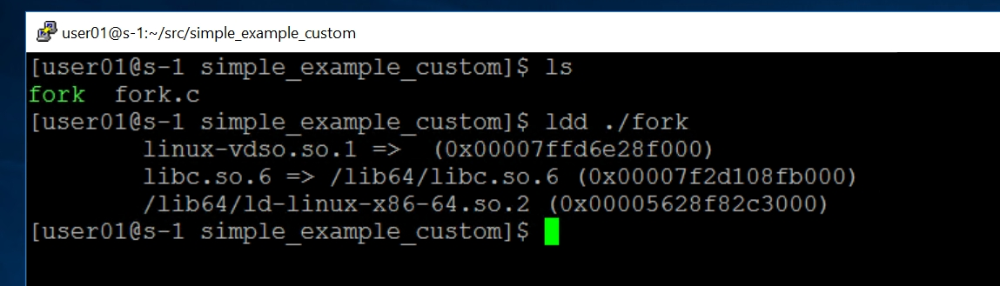

## Задание

Посмотреть при помощи команды `ldd,` с какими разделяемыми библиотеками слинкован полученный в пункте 4 исполняемый файл, и коротко написать, что это за библиотеки. Если в пункте 6 также получен бинарник, сделать то же самое с ним. 

## Решение

Код программы */home/user01/src/simple_example_custom/__fork.c__* (сама программа — как в предыдущей задаче)

```c
#include <stdio.h>
#include <unistd.h>

int main(void) {
    fork();
    puts("Hello, Fintech World!");
    return 0;
}
```

Результат работы команды `ldd ./fork`



Пара слов про библиотеки:

* linux-vdso.so.1 — является виртуальной библиотекой, или виртуальным динамически разделяемым объектом (VDSO), который размещается только в адресном пространстве отдельной программы. Эта виртуальная библиотека содержит всю необходимую логику, обеспечивающую для пользовательских приложений наиболее быстрый доступ к системным функциям в зависимости от архитектуры процессора – либо через прерывания, либо (для большинства современных процессоров) через механизм быстрых системных вызовов.

  Информация про библиотеку бралась отсюда [ibm.com/developerworks](https://www.ibm.com/developerworks/ru/library/l-lpic1-v3-102-3/index.html).

* [libc.so.6](https://ru.wikipedia.org/wiki/Glibc) — библиотека Си, которая обеспечивает системные вызовы и основные функции: *open()*, *malloc()*, *printf()* и т. д.

* ld-linux-x86-64.so.2 — исполняемый файл, содержит код, отвечающий за динамическую загрузку. Считывает информацию из заголовка исполняемого файла, созданного в формате исполняемых и компонуемых модулей (Executable and Linking Format, ELF), и на её основании определяет, какие библиотеки требуются данному приложению и должны быть загружены. После этого выполняется динамическая компоновка приложения, приводящая в соответствие указатели его адресов и указатели адресов загруженных библиотек, в результате чего приложение может быть запущено. 

  Информация тоже отсюда [ibm.com/developerworks](https://www.ibm.com/developerworks/ru/library/l-lpic1-v3-102-3/index.html).